# Aerial Tactile Simulation Framework

A simulation framework for **tactile sensing on aerial manipulators**. The goal is to
build a system where a flying robot can *feel* surfaces through a vision-based tactile
sensor on its end-effector and autonomously follow geometric features (edges, ridges)
using learned contact-pose estimation.

This combines two research areas:
- **Tactile servoing:** a CNN estimates 6-DOF contact pose from tactile images, then a
  servo controller tracks a reference pose.
- **Aerial physical interaction:** a fully-actuated hexarotor with an L-shaped end-effector
  makes controlled contact with surfaces using admittance control and wrench estimation

| Tactile image (no contact) | Tactile image (contact with edge) | CNN prediction vs ground truth |
|---|---|---|
| 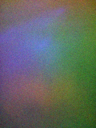 |  | 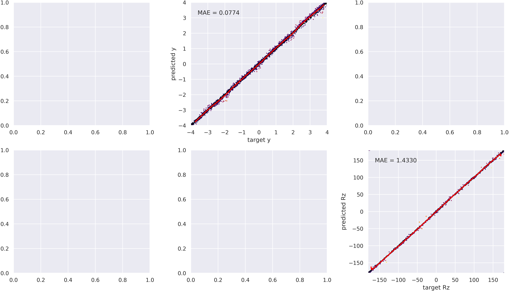 |

## Context

This project started as a course project for the Aerial Robotics Laboratory
(Politecnico di Milano, 2025-26) and evolved into thesis-level work on tactile
sensing for aerial manipulation.

The flight simulation stack --
[TeleKyb3](https://github.com/lerema/telekyb3-genom3) (GenoM3 middleware, Gazebo
plugins, `phynt-genom3`, and all control components) was developed by the
LAAS-CNRS / INRIA team. We use it as-is inside a Docker image provided by the
course. For full attribution to the TeleKyb3 developers and my earlier course
assignments, see:
[Aerial-Robotics-FromHoverToContact](https://github.com/gizemdogafiliz/Aerial-Robotics-FromHoverToContact).

This project builds on Assignment 6a, where I added an L-shaped end-effector to
the TiltHex hexarotor and implemented admittance-controlled wall contact using
`phynt-genom3`. The extension here is adding tactile perception.

### Assignment 6a recap: aerial physical interaction

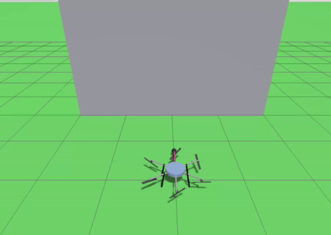

The hexarotor flies an end-effector tip into a wall and traces a square pattern.
An admittance filter + wrench observer (`phynt`) provides compliant contact.
**What's missing:** no tactile sensing. The drone knows it's pushing but cannot
feel *where* or *how* it contacts the surface.

---

## What is Pose-Based Tactile Servoing (PBTS)?

The core idea, in one loop:

```
                    ┌─────────────────────────────────────────┐
                    │                                         │
  Tactile sensor    │   CNN predicts        Servo controller  │       Robot
  captures image ──►│   contact pose  ──►   computes error    |  ──►  moves to
  (pin deformation) │   (y, Rz)             from reference    │       correct
                    │                                         │
                    └─────────────────────────────────────────┘
                                  repeats at ~50 Hz
```

1. A **TacTip optical sensor** has hundreds of pins on a soft membrane. When pressed against
   a surface, pins deform and a camera inside captures the deformation as an image.
2. A **NatureCNN** (trained on 5000 labelled examples) maps the image to a contact pose:
   where the edge is relative to the sensor (position in mm + angle in degrees).
3. A **proportional controller** compares predicted pose to a desired reference and moves
   the robot to reduce the error.
4. Repeat. The robot reactively follows edges without any planned trajectory.

---

## Project Structure

This repository contains all custom code, modified Gazebo files, and results.
Three open-source dependencies are **not included**; clone them into the project
directory (see [Dependencies](#dependencies-what-to-clone-and-why) below).

```
aerial-tactile-sim/
├── README.md
├── assets/                               plots and images for this README
│
├── scripts/                              Phase 1 & 3A & 4: PyBullet tactile (local)
│   ├── 01_test_tacto.py                      TACTO tactile rendering demo
│   ├── 02_train_edge2d.py                    train CNN pose estimator from scratch
│   ├── 03_watch_data_collection.py           watch data collection in GUI (20 samples)
│   ├── 04_test_retrained_servo.py            servo control with our trained model
│   ├── 05_test_contact_sensor.py             read Gazebo contact sensor (Docker)
│   ├── 06_collect_ridge_data.py              Phase 3A: rectangular frame dataset + video
│   ├── 07_train_ridge_cnn.py                 Phase 4: train ridge_4d CNN (NatureCNN/ResNet)
│   ├── 08_hough_ridge_detect.py              Phase 4: classical ridge detection (Radon/Hough)
│   ├── 09_evaluate_comparison.py             Phase 4: hybrid evaluation + comparison plots
│   └── 10_servo_on_ridge.py                 Phase 3B validation: servo on ridge frame (PyBullet)
│
├── src/                                  Phase 2 & 3B: Gazebo + TeleKyb3 (Docker)
│   ├── 06a-physical-interaction/             Assignment 6a: wall contact + square pattern
│   │   ├── simulation.sh                         Gazebo + GenoM3 launcher
│   │   ├── model_hexa_fa.py                      flight script (hover → contact → pattern)
│   │   └── plot_06a.py                            post-flight plotting
│   └── 07-aerial-tactile/                    Phase 2+: contact sensor + servo bridge
│       ├── simulation.sh                         launches Gazebo with tactile world + model
│       ├── model_hexa_fa_tactile.py              Phase 2: contact sensor experiment
│       ├── tactile_servo_bridge.py               Phase 3B: velocity-based tactile servo
│       ├── plot_servo.py                          servo run visualization
│       ├── plot_07.py                             Phase 2 plotting
│       └── plots/                                 saved plot images from servo runs
│
├── gazebo/                               Gazebo model + world files
│   ├── models/
│   │   ├── mrsim-tilthex/                    original hexarotor SDF (with L-shaped EE)
│   │   └── mrsim-tilthex-tactile/            COPY + contact sensor on EE tip
│   └── worlds/
│       ├── hexa-fa-wall-world.world          original wall world (Assignment 6a)
│       └── hexa-fa-wall-tactile.world        COPY + contact-system plugin + ridge frame
│
├── output/
│   ├── evaluation/                       Phase 4: comparison plots
│   ├── ridge_dataset/                    Phase 3A: 5001 tactile images + labels
│   └── trained_models/edge_2d/           Phase 1: retrained CNN weights + params
│
│   --- clone these into the project directory (not included in the repo) ---
│
├── tacto/                            git clone https://github.com/facebookresearch/tacto
├── tactile_gym_2/                    git clone https://github.com/yijionglin/tactile_gym_2
└── servo_control/                    git clone https://github.com/ac-93/tactile_gym_servo_control
```

---

## Dependencies: What to Clone and Why

These three repos form the tactile simulation stack. Each is an independent open-source
project; we use them as-is with minor compatibility fixes.

| Clone into | Source repo | What it does | We use it for |
|---|---|---|---|
| `tacto/` | [facebookresearch/tacto](https://github.com/facebookresearch/tacto) | Renders DIGIT/GelSight tactile images using PyBullet + pyrender | Phase 1: understanding tactile rendering |
| `tactile_gym_2/` | [yijionglin/tactile_gym_2](https://github.com/yijionglin/tactile_gym_2) | PyBullet environments with simulated TacTip/DIGIT/DigiTac sensors | Sensor simulation + utilities |
| `servo_control/` | [ac-93/tactile_gym_servo_control](https://github.com/ac-93/tactile_gym_servo_control) | Full PBTS pipeline: data collection, CNN training, servo control. Includes pretrained models and 7000 labelled tactile images | Phase 1: entire tactile servoing pipeline |

**Clone commands:**

```bash
cd ~/aerial-tactile-sim   # or wherever you cloned this repo
git clone https://github.com/facebookresearch/tacto
git clone https://github.com/yijionglin/tactile_gym_2
git clone https://github.com/ac-93/tactile_gym_servo_control servo_control
```

### Compatibility fixes applied to cloned repos

The repos were written for older Python/NumPy. Three small fixes needed:

| File | Issue | Fix |
|---|---|---|
| `servo_control/.../collect_data.py` | `np.warnings` removed in NumPy 2.x | Replaced with `import warnings; warnings.filterwarnings(...)` |
| `servo_control/.../data_collection_utils.py` | `np.hstack` rejects mixed-type tuples in NumPy 2.x | Replaced with Python list unpacking `[*pose, *move]` |
| `servo_control/.../servo_control.py` | `device` variable used but never passed to function | Added `device` parameter to `run_servo_control()` |

---

## Environment Setup

### Phase 1: Conda environment (local, PyBullet tactile)

```bash
conda create -n tactile python=3.9 -y
source ~/miniconda3/etc/profile.d/conda.sh   # needed if conda not in PATH
conda activate tactile

pip install torch torchvision --index-url https://download.pytorch.org/whl/cu124

cd ~/aerial-tactile-sim/tacto && pip install -e .
cd ~/aerial-tactile-sim/tactile_gym_2 && pip install -e .
cd ~/aerial-tactile-sim/servo_control && pip install --no-deps -e .

pip install networkx==3.2.1 pytorch_model_summary vit_pytorch imageio
```

### Phase 2+: Docker (Gazebo + TeleKyb3)

The TeleKyb3 stack (GenoM3, Gazebo Ionic, all aerial control components) runs inside a
Docker image provided by the course. Cannot be installed natively (requires robotpkg,
GenoM3 middleware, pocolibs, and 9+ custom components).

**Starting the Docker environment:**

```bash
cd ~/tk3lab/releases/r-1.3/scripts
sh tk3lab-run -g ionic -v 0.2
# Opens noVNC desktop at http://127.0.0.1:6080
# ~/tk3lab-ws/ on host = /shared-workspace/ in Docker
```

**Deploy repo files into the Docker workspace (first time):**

The Docker container mounts `~/tk3lab-ws/` as `/shared-workspace/`. Copy the Gazebo
files and simulation scripts into this workspace:

```bash
# On the host machine (not inside Docker):
cp -r ~/aerial-tactile-sim/gazebo/models/mrsim-tilthex-tactile ~/tk3lab-ws/gazebo/models/
cp ~/aerial-tactile-sim/gazebo/worlds/hexa-fa-wall-tactile.world ~/tk3lab-ws/gazebo/worlds/
cp -r ~/aerial-tactile-sim/src/06a-physical-interaction ~/tk3lab-ws/src/
cp -r ~/aerial-tactile-sim/src/07-aerial-tactile ~/tk3lab-ws/src/
```

**Exiting Docker / stopping a simulation:**

```
>>> quit()    # exit Python interactive session
Ctrl+C        # stop simulation.sh in the other terminal
```

---

## Phase Overview

| Phase | Description | Status |
|---|---|---|
| 1. PBTS in PyBullet | Tactile rendering, data collection, CNN training, servo control | Completed |
| 2. Gazebo contact sensor | Contact sensor on hexarotor EE tip, Python data logging, log parsing | Completed |
| 2b. Wall ridge frame | 1m×1m rectangular ridge frame (5mm protrusion) on wall | Completed |
| 3A. PyBullet dataset | TacTip + rectangular ridge frame, 5001 samples, sequential perimeter sampling | Completed |
| 4. Ridge perception | CNN + classical (Radon) ridge detection, hybrid evaluation | Completed |
| 3B. Velocity-based servo | Velocity-based tactile servo bridge with geometric sensor, ridge following | **In Progress** |
| 3C. Dual-simulator bridge | Live EE pose sync from Gazebo → PyBullet for online tactile rendering | Planned |
| 5. Aerial tactile servoing | Close the loop: tactile CNN + aerial admittance control + mocap | Planned |
| 6. Vibration robustness | Domain randomization + notch filters for propeller noise | Planned |

---

## Phase 1: Tactile Servoing in PyBullet (completed)

All scripts run locally with `conda activate tactile`.

### 1.1 TACTO rendering demo

```bash
cd ~/aerial-tactile-sim/scripts && python 01_test_tacto.py
```

Renders a DIGIT sensor pressing a sphere at different depths. Demonstrates how tactile
images change with penetration (deeper contact = more pin deformation).

| No contact | Light contact | Deep contact |
|---|---|---|
|  | 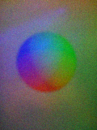 | 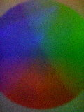 |

### 1.2 Data collection demo (GUI)

```bash
python 03_watch_data_collection.py
```

Opens PyBullet with a TacTip sensor and a square block. The sensor moves to 20 random
positions along the block's edge, presses down, and captures a tactile image at each.

**How ground truth is generated:** The work frame sits directly above the edge. Random
poses are relative to this frame, with z always positive (2-5.5mm) guaranteeing contact.
Since we command the position in simulation, the commanded pose IS the ground truth
label. Each sample produces an `(image, pose)` pair saved to CSV + PNG.

### 1.3 CNN training from scratch

```bash
python 02_train_edge2d.py
```

Trains a NatureCNN on 5000 pre-collected tactile images (included in the servo_control
repo). The network learns: *"given this pin deformation pattern, the edge is at position
y and angle Rz relative to my sensor."*

- **Architecture:** NatureCNN (3 conv layers: 32→64→64, 2 FC layers: 512→512, output: 3)
- **Output encoding:** normalized y + sin(Rz) + cos(Rz) = 3 values
- **Loss:** MSE, optimizer: Adam (lr=1e-4), scheduler: ReduceLROnPlateau
- **Training:** 50 epochs, batch size 128, CUDA

| Training curves (loss + accuracy) | Predicted vs target |
|---|---|
| 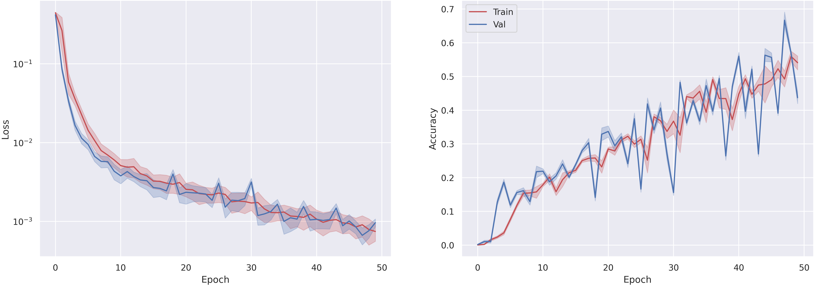 |  |

**Results at 50 epochs:** MAE y = 0.077mm (range: 8mm), MAE Rz = 1.43° (range: 360°).
Train/val curves overlap = no overfitting, sufficient data.

### 1.4 Servo control with trained model

```bash
python 04_test_retrained_servo.py
```

Closes the loop: CNN prediction → error computation → robot movement → new image → repeat.
PyBullet GUI shows sliders to change the reference pose. The sensor tracks the edge
reactively with no trajectory planning, purely local feedback at each timestep.

To compare with the pretrained (250 epoch) model, change `model_dir` in the script to
`.../learned_models/edge_2d/tap`.

<video src="https://github.com/user-attachments/assets/084c75b0-ccc1-4199-8ce4-0634203cb4a7" width="600" controls></video>

---

## Phase 2: Gazebo Contact Sensor on Hexarotor (completed)

### Background: the end-effector

In Assignment 6a, an L-shaped end-effector was added to the TiltHex hexarotor SDF:
a vertical bar from the body centre dropping to z=-0.125m, then a horizontal bar
extending 0.6m along the body x-axis, ending in a sphere tip (radius 0.02m, scaled
to match TacTip sensor dimensions).
The hexarotor flies this tip into a wall and slides a 1m square pattern using
admittance control (`phynt-genom3`).

| 06a: EE position + contact force | Estimated external wrench |
|---|---|
| 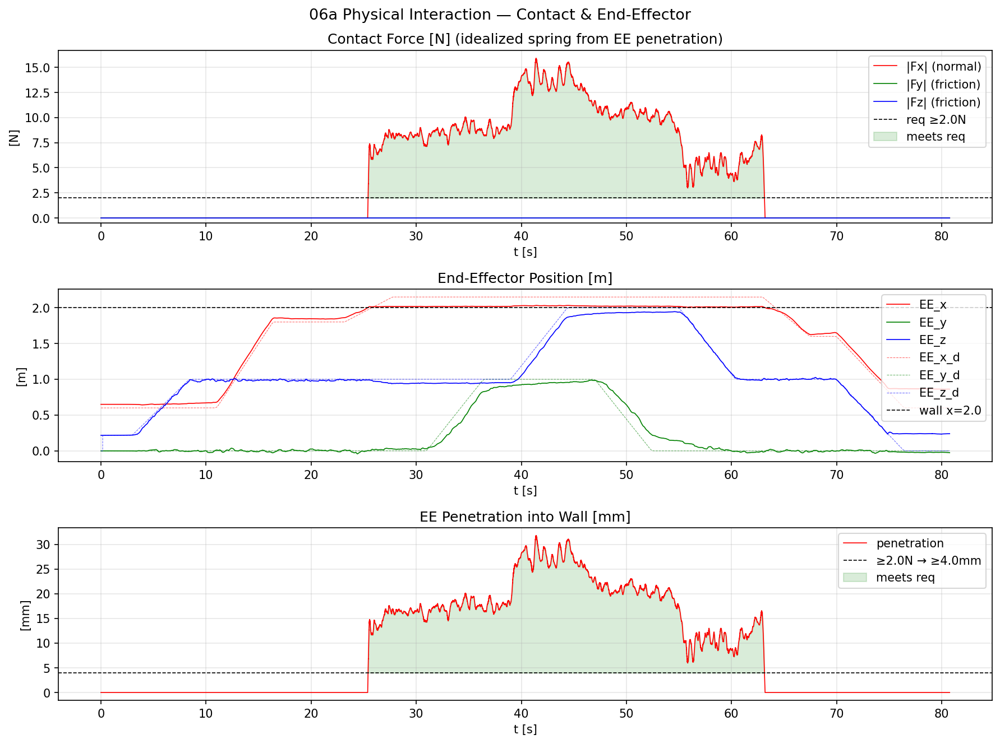 | 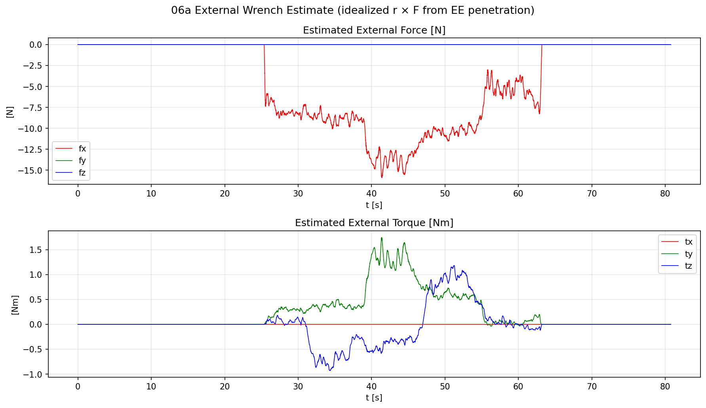 |

To run Assignment 6a (flat wall, no contact sensor):
```bash
cd /shared-workspace/src/06a-physical-interaction
sh simulation.sh
# In another terminal:
python3 -i model_hexa_fa.py
>>> simulation()
```

### What was added for Phase 2

The original setup has no tactile sensor. `phynt` estimates a single net wrench from
the dynamics model, with no spatial resolution. We added:

**1. Contact sensor on the tip sphere** (`gazebo/models/mrsim-tilthex-tactile/model.sdf`):

```xml
<sensor name="ee_contact_sensor" type="contact">
  <always_on>true</always_on>
  <update_rate>100</update_rate>
  <contact>
    <collision>ee-tip-col</collision>
  </contact>
</sensor>
```

`ee-tip-col` is the sphere collision at the tip. The sensor publishes contact data
(position, normal, penetration depth, wrench) to a gz topic whenever this sphere
touches anything.

**2. Contact system plugin** (`gazebo/worlds/hexa-fa-wall-tactile.world`):

```xml
<plugin name="gz::sim::systems::Contact" filename="gz-sim-contact-system"/>
```

Gazebo computes collisions internally but does not expose them by default. This plugin
enables contact sensors to publish their data to gz transport topics.

**3. Python simulation script** (`src/07-aerial-tactile/model_hexa_fa_tactile.py`):

Extended the 06a flight script with:
- `ContactReader` class: background subprocess reads `gz topic -e` with non-blocking IO,
  parses contact position/normal/force from protobuf text output via regex
- Real-time `pom.frame('robot')` reads for position/attitude/velocity
- Post-simulation log parsing: `pom.log`, `uavpos.log`, `maneuver.log` are parsed
  for AF-filtered reference, nominal trajectory, and idealized contact force
  (same approach as 06a's plotting pipeline)

To monitor contact data from the sensor (inside Docker):
```bash
gz topic -e -t /world/mrsim/model/hr6/link/base/sensor/ee_contact_sensor/contact
```

For running the full drone simulation and results, see [Phase 3B](#phase-3b-velocity-based-tactile-servo-bridge-in-progress).

### Rectangular ridge frame on wall (Phase 3 preparation)

Phase 2 used a flat wall where the contact sensor works but every touch point looks
the same. For tactile edge following, the wall needs a **3D geometric feature**
that the sensor can detect and the CNN can learn to localize.

We added a 1m × 1m rectangular ridge frame on the wall surface, aligned with
the drone's square trajectory. Four thin box ridges (5mm protrusion,
5mm cross-section) form a closed rectangle. The 5mm size is realistic for
real-world features:

```
Wall surface (front view, looking from drone toward wall):

    y=0                                    y=1
     │                                   │
z=1.875 ┌─────────────────────────────┐  |
     │  │        top ridge            │  │
     │  │                             │  │
     │  │                             │  │
     │  │                             │  │
     │  │ left                  right │  │
     │  │ ridge                 ridge │  │
     │  │                             │  │
     │  │                             │  │
     │  │                             │  │
     │  │       bottom ridge          │  │
z=0.875 └─────────────────────────────┘  │

Ridge cross-section (side view):
         ┌──┐
         │5 │ 5mm protrusion toward drone
    ─────┘  └───── wall surface (x=2.0)
```

**File:** `gazebo/worlds/hexa-fa-wall-tactile.world` (`wall_frame` model with
4 ridge collisions, positioned to match the EE tip trajectory (body y=[0,1],
body z=[1.0,2.0], EE z offset = -0.125m)).

---

## Phase 3A: Tactile Dataset Collection (completed)

The CNN needs labelled (tactile_image, contact_pose) pairs. These are generated entirely
in PyBullet using a TacTip sensor and a rectangular ridge frame; no Gazebo needed.

### Rectangular ridge frame stimulus

A 120x120mm rectangular ridge frame on a flat wall plate (`wall_ridge_frame.urdf`).
Four 5mm ridges (5mm protrusion, 5mm width, matching the Gazebo scenario) form a
closed rectangle with 4 corners:

```
  Top view (workframe coords, mm):

  wf_x=+60   ┌─────────────────────┐
             │      top ridge      │
             │                     │
    left     │                     │  right
    ridge    │      (center)       │  ridge
             │                     │
             │     bottom ridge    │
  wf_x=-60   └─────────────────────┘
          wf_y=-60              wf_y=+60
```

This matches the actual Gazebo drone scenario: a rectangular ridge frame on the
wall that the hexarotor traces with its end-effector.

### Sequential perimeter sampling

The sensor walks the full perimeter CW (top -> right -> bottom -> left), collecting
one sample at each evenly-spaced position. Pose variation (cross-offset, depth,
angles) is randomized at each point. The DataLoader shuffles during CNN training.

| Zone | What the sensor sees | How it arises |
|---|---|---|
| Straight (~70%) | Single ridge edge | Sensor >18.5mm from any corner vertex |
| Corner (~30%) | L-shaped pattern (two ridges) | Sensor within 18.5mm of a corner (dome radius + ridge half-width) |

All 4 sides sampled equally (~25% each). All 4 corner orientations (0/90/180/270)
appear naturally, so no rotation augmentation is needed for corner generalization.

Each sample varies: cross-ridge offset (+-14mm), depth (-2 to 5.5mm),
roll/pitch (+-15 deg), yaw (+-20 deg).

### Dataset structure

```
output/ridge_dataset/collect_MMDD_HHMM/
├── images/           tactile images (128x128 PNG)
├── labels.csv        ground-truth labels per image
├── targets.csv       servo_control pipeline format
└── params.json       collection parameters
```

Key label columns: `d_nearest_mm`, `signed_d_nearest_mm`, `nearest_ridge`,
`d_second_nearest_mm`, `is_corner`, `side`, `depth_mm`.

### Data collection demo

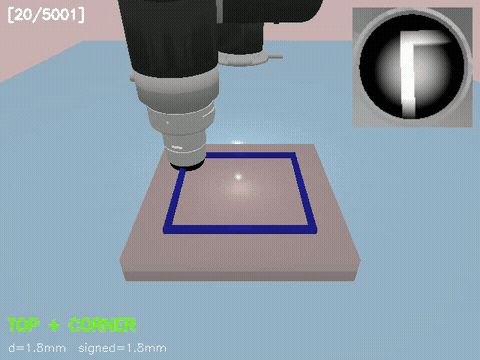

Sensor traverses the rectangular frame CW, collecting tactile images at each position.
Overlay shows side label, corner flag, and distance to nearest ridge.

### How to run

```bash
source ~/miniconda3/etc/profile.d/conda.sh && conda activate tactile
cd ~/aerial-tactile-sim/scripts

# Quick test (20 samples, GUI)
python 06_collect_ridge_data.py

# Watch collection (60 samples, GUI + video)
python 06_collect_ridge_data.py --n 60 --record

# Full dataset (5001 samples, headless + video of all frames)
python 06_collect_ridge_data.py --n 5001 --no-gui --record

# Train CNN (auto-finds latest dataset, splits 80/20, trains)
python 07_train_ridge_cnn.py --epochs 200                   # NatureCNN
python 07_train_ridge_cnn.py --epochs 200 --model resnet    # ResNet
```

### CNN target derivation (Phase 4)

The raw labels store distances to all 4 ridges, but the CNN outputs only what
it can observe from the tactile image:

| CNN output | Mapped to | Derived from | Range |
|---|---|---|---|
| `y` (pose_2) | signed_d_nearest_mm | Distance to nearest ridge | ±14 mm |
| `z` (pose_3) | depth_mm | Contact penetration depth | -2 to 5.5 mm |
| `Rx` (pose_4) | ridge_orient_deg | Orientation of nearest ridge | 0° or 90° |
| `Rz` (pose_6) | yaw_deg | Sensor rotation relative to ridge | ±20° |

Position outputs (y, z) use linear normalization within pose limits.
Rotation outputs (Rx, Rz) use sin/cos encoding for continuity.
The `collection_params.json` stores the pose limits used for normalization.

---

## Phase 4: Ridge Perception, CNN + Classical (completed)

Three approaches evaluated on the same val set (1001 samples) for estimating
sensor-ridge relative pose from tactile images:

### What the system estimates

| Output | Meaning | Used for |
|---|---|---|
| `distance` | Perpendicular distance from sensor center to nearest ridge (mm) | Cross-track correction |
| `orient` | Ridge type: horizontal (0°) or vertical (90°) | Which axis to correct along |
| `depth` | Contact penetration depth (mm) | Force/compliance control |
| `yaw` | Sensor rotation relative to ridge (°) | Angular alignment correction |

### Results

| Method | distance MAE | depth MAE | orient acc | yaw MAE | Inference |
|---|---|---|---|---|---|
| NatureCNN (200ep) | 4.07 mm | **0.08 mm** | **99.0%** | 2.01° | 72.8 ms |
| ResNet (100ep) | 4.23 mm | 0.30 mm | 94.7% | 2.83° | -- |
| Radon (classical) | 1.55 mm | -- | 97.1% | -- | **0.95 ms** |
| **Hybrid (CNN orient + Radon dist)** | **1.47 mm** | **0.08 mm** | **99.0%** | 2.01° | ~2 ms |

The hybrid feeds CNN orientation (99.0%) into Radon's single-angle projection for
distance estimation (1.47mm), taking depth and yaw from the CNN. This outperforms
both Radon-only distance (1.55mm) and Radon-only orient (97.1%) by using each
method where it is strongest. The CNN-only approach is used for the servo demo
since it requires no classical preprocessing pipeline.

| Training curves (loss + accuracy) | Predicted vs target |
|---|---|
| 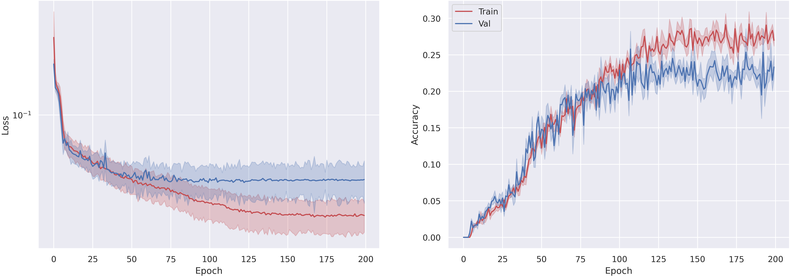 | 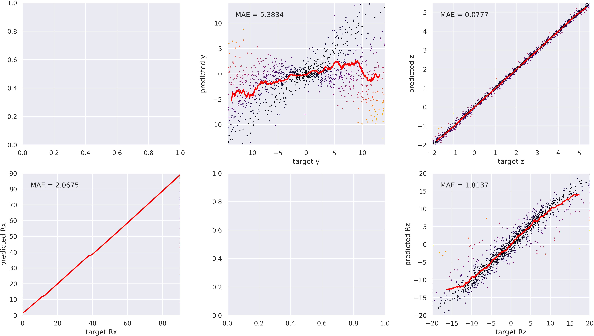 |

| Comparison bar chart | Scatter: predicted vs target | Orientation confusion matrices |
|---|---|---|
| 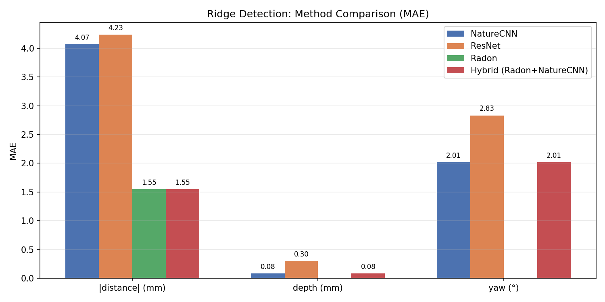 | 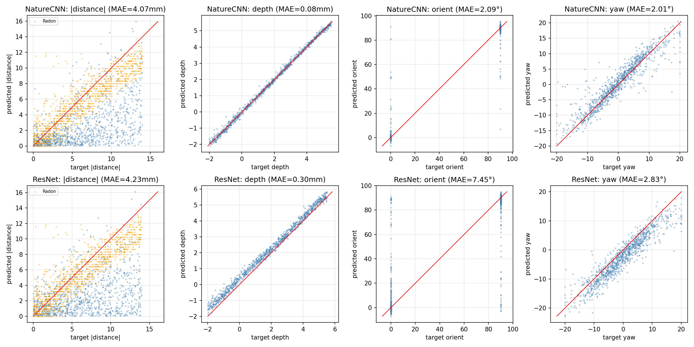 | 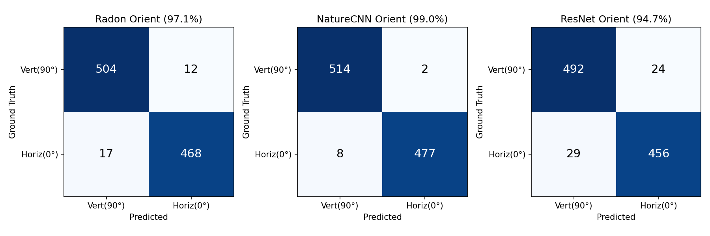 |

### How the servo loop uses these outputs

```
At each timestep:
  1. Tactile image → CNN extracts distance, orient, depth, yaw
  2. Orient (H or V) → determines correction axis (Y or X)
  3. error_position = desired_distance - predicted_distance  → move along correction axis
  4. error_depth    = desired_depth    - predicted_depth     → move along contact normal
  5. error_yaw      = 0                - predicted_yaw       → rotate to align with ridge
  6. Admittance controller converts errors to velocity commands → drone moves
```

Example: sensor detects horizontal ridge 3mm to the left, 0.5mm too deep, 4° rotated.
Controller outputs: move right 3mm, retract 0.5mm, rotate -4°. Next frame re-estimates,
loop converges to desired tracking pose.

### How to run

```bash
source ~/miniconda3/etc/profile.d/conda.sh && conda activate tactile
cd ~/aerial-tactile-sim/scripts

# Train CNN (auto-finds latest dataset)
python 07_train_ridge_cnn.py --epochs 200                    # NatureCNN
python 07_train_ridge_cnn.py --epochs 200 --model resnet     # ResNet

# Classical detection (Radon or Hough)
python 08_hough_ridge_detect.py --method radon               # full dataset eval
python 08_hough_ridge_detect.py --method hough               # Hough comparison
python 08_hough_ridge_detect.py --image path/to/img.png      # single image

# Hybrid comparison (generates plots in output/evaluation/)
python 09_evaluate_comparison.py
```

### PyBullet Validation: CNN-Based Servo

Before deploying on the drone, the trained CNN replaces the geometric placeholder
sensor in a closed-loop servo test. `10_servo_on_ridge.py` runs the ridge_4d
NatureCNN + ServoController + CornerDetector on the rectangular ridge frame
stimulus. The CNN predicts signed distance, orientation, depth, and yaw from
each tactile image, with no geometric prior or position-based heuristics.

Full rectangle traversal (4 ridges, 4 corners) completes in ~465 steps at
20mm/s forward speed. Tracking accuracy: ~0.5mm on straight sections, ~3mm
offset after corner transitions.

```bash
conda activate tactile
cd ~/aerial-tactile-sim/scripts
python 10_servo_on_ridge.py              # GUI + video
python 10_servo_on_ridge.py --no-video   # GUI only
```

<video src="https://github.com/user-attachments/assets/6084fdbd-eca7-4fcd-ab22-24ce64322e31" width="600" controls></video>

---

## Phase 3B: Velocity-Based Tactile Servo Bridge (in progress)

Real-time ridge following on the rectangular wall frame using the fully-actuated
hexarotor. Switched from `maneuver.goto()` to `maneuver.velocity()` to solve
friction-lock: with goto, each position correction generated AF forces below wall
friction threshold (F_correction < μ·F_normal), locking the EE in place. Velocity
commands provide continuous motion that overcomes static friction.

### Architecture

```
Inner loop (1000 Hz, untouched):
  maneuver → phynt(AF+WO) → uavpos → uavatt → motors

Outer loop (~1 Hz, this script):
  pom.frame('robot') → body_to_ee_tip(FK) → GeometricTactileSensor
    → ServoController(v = -λ·e) → maneuver.velocity()
```

**Servo law:** `v = clip(-λ · e, ±MAX_SERVO_VEL)`, stateless velocity-based
tactile servoing. No position accumulation, no integrator drift.

**GeometricTactileSensor:** Perfect ground-truth sensor simulating TacTip dome
behavior. Contact detection via `DOME_PROXIMITY` (5mm), cross-track detection
via `TIP_RADIUS` (20mm). CNN-compatible interface; returns `(signed_d, depth, orient)`
or `None` when no contact. When CNN replaces this, servo code stays unchanged.

### Key Parameters

| Parameter | Value | Rationale |
|---|---|---|
| `SERVO_LAMBDA` | 0.15 | Convergence rate (1/s), stability: λ·Δt < 1 |
| `VEL_DURATION` | 2.0 s | Velocity command duration (overlaps next step) |
| `STEP_SLEEP` | 1.0 s | Sensor loop rate (~1 Hz) |
| `FORWARD_SPEED` | 0.035 | 35mm/s along ridge |
| `MAX_SERVO_VEL` | 20 mm/s | Cross-track velocity clamp |
| `CONTACT_BODY_X` | 1.45 | AF x-reference: F ≈ K_x·(1.45−body_x) ≈ 7N |
| `RAMP_STEPS` | 5 | Ramp forward velocity to avoid roll transients |
| `DOME_PROXIMITY` | 5 mm | Soft dome contact detection range |

### Corner Handling & Recovery

- **Corner detection:** orientation change (horizontal ↔ vertical) triggers
  direction switch with cooldown
- **Ramp reset:** forward velocity ramps from 0 after each corner (avoids roll
  transients from sudden direction change)
- **Recovery scan:** when ridge lost for 8+ steps, return to last known position
  and scan ±180mm in cross-track direction

### How to run

Start the Docker environment and deploy the files as described in
[Environment Setup](#phase-2-docker-gazebo--telekyb3). Then inside Docker:

**Contact sensing flight** (pre-planned square pattern, logs contact data):
```bash
# T1: start Gazebo + all GenoM3 components
cd /shared-workspace/src/07-aerial-tactile
sh simulation.sh

# T2: fly the hexarotor into the wall
cd /shared-workspace/src/07-aerial-tactile
python3 -i model_hexa_fa_tactile.py
>>> simulation()
```

**Tactile servo bridge** (reactive ridge following with geometric sensor):
```bash
# T2: run servo bridge instead of the pre-planned flight
python3 -i tactile_servo_bridge.py
>>> simulation()
```

To exit:
```
>>> quit()
Ctrl+C
```

**Plotting results after a servo run:**
```bash
python3 plot_servo.py           # latest run
python3 plot_servo.py exp_name  # tagged run
```

### Contact sensing results

The contact sensing flight runs ~80 seconds: hover, approach, wall contact,
trace pattern inside ridge frame, retract, land. Two data sources are read in
real time:
1. **pom** (via genomix): position, attitude, velocity at 50Hz
2. **Contact sensor** (via gz topic subprocess): contact point, normal, force

Contact sensor output format (example from wall interaction):

```
collision1: "hr6::base::ee-tip-col"           # sensor tip
collision2: "contact_wall::wall::collision"    # the wall
position:   {x: 2.0, y: 0.3, z: 0.9}         # contact point (world frame)
normal:     {x: -1}                            # wall surface normal
depth:      8.2e-06 m                          # penetration
wrench:     force: {x: -2.25, y: 0.1, z: -0.1}   # contact force (N)
```

This gives us **spatially resolved** contact data that the wrench observer alone
cannot provide.

**Why two simulators:** In Gazebo, the drone's rigid EE sphere cannot slide over
rigid ridges without collision instability. The ridges serve as geometric
references for the servo controller (GeometricTactileSensor computes distance
to the nearest ridge). The actual tactile images for CNN training are generated
in PyBullet (Phase 3A), where a soft TacTip dome deforms around the same ridge
geometry.

### Current Status (drone)

Best result: bottom ridge tracked with cross-track error converging, 2 corners
detected (bottom→left, left→top). Full rectangle traversal not yet completed.
Intermittent contact loss during velocity transitions. EE oscillates in/out of
dome detection range (5mm). Root cause fix in progress.

**EE trajectory from latest servo run:**

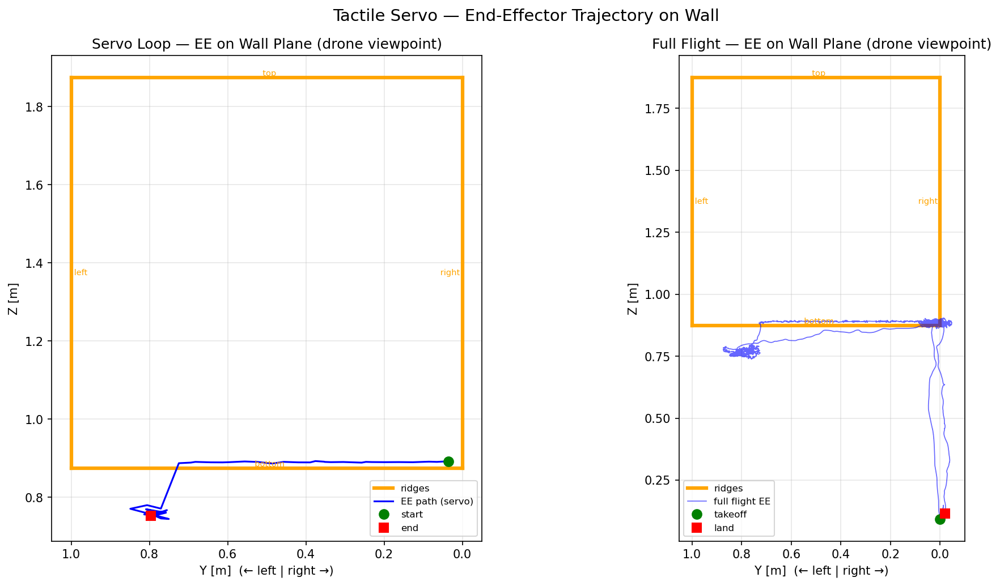

### Known Limitations

- Pitch-EE coupling: contact force → pitch moment (F·L_bar=0.6m) → EE displacement
  (~10mm/° pitch), creating systematic cross-track offset
- Intermittent contact loss during velocity transitions
- Balancing contact force vs pitch coupling: higher CONTACT_BODY_X = more reliable
  contact but more pitch disturbance
- Geometric sensor approximates CNN behavior; real deployment needs TACTO + CNN

### Next Steps

1. Eliminate contact loss with the geometric sensor (root cause fix)
2. Complete full rectangle traversal (4 corners, 4 ridges)
3. Integrate PyBullet/TACTO for realistic tactile image rendering (Phase 3C)
4. Train CNN on TACTO data, replace geometric sensor (drop-in, same output format)

---

## Hardware / Software

| Component | Detail |
|---|---|
| GPU | NVIDIA GeForce RTX 4060 Laptop (CUDA) |
| Local env | Conda `tactile`, Python 3.9, PyTorch 2.6.0+cu124 |
| Docker | `art/tk3lab:ionic-0.2` (14.3GB), Gazebo Ionic + TeleKyb3 |
| OS | Ubuntu 24.04, Linux 6.17 |
